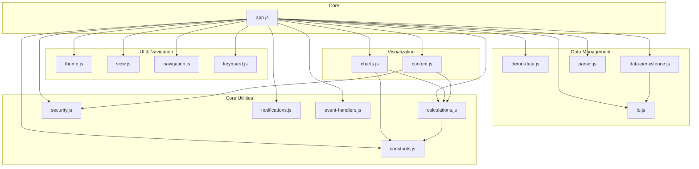
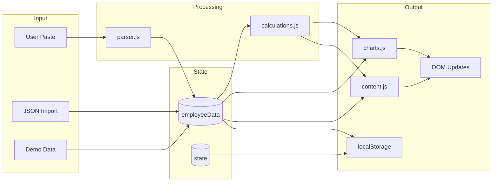
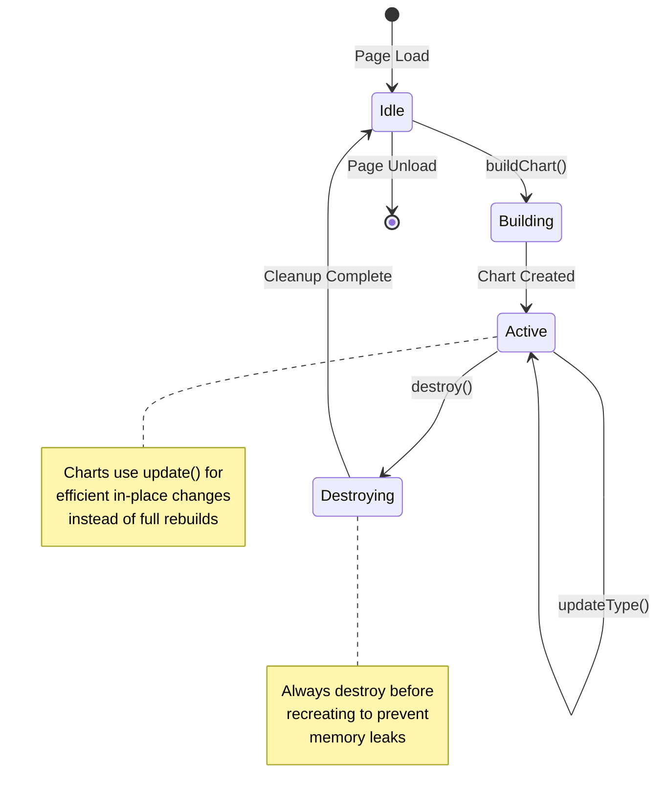

# Paylocity Compensation Journey - Project Guidelines

## Project Overview

Paylocity Compensation Journey transforms raw Paylocity pay history data into a comprehensive financial dashboard with visualizations, analytics, and benchmark comparisons. This single-file web app provides employees with insights that Paylocity's native interface doesn't offer.

**Live Demo**: https://tejasgadhia.github.io/paylocity-compensation-journey/

## Tech Stack

- **Core**: `index.html` (HTML) + `styles.css` (CSS) + modular JavaScript
- **JavaScript Modules** (21 total, ~5,200 lines):
  - **Core** (~500 lines):
    - `app.js` - State management, module orchestration, initialization
  - **UI & Navigation** (~460 lines):
    - `js/theme.js` - Theme switching (tactical/artistic)
    - `js/view.js` - View mode (dollars/indexed), display updates
    - `js/navigation.js` - Tab switching, URL params, history
    - `js/keyboard.js` - Keyboard shortcuts (1-7 for tabs, t/v for toggles)
  - **Data Management** (~640 lines):
    - `js/demo-data.js` - Demo scenarios (4 career stages)
    - `js/data-persistence.js` - LocalStorage backup/restore
    - `js/io.js` - File import/export (JSON, HTML)
    - `js/parser.js` - Paylocity data parser
    - `js/validation.js` - Input validation, parse pipeline (DI pattern)
  - **Visualization** (~1,300 lines):
    - `js/charts.js` - Chart.js wrappers (main, YoY, projection)
    - `js/content.js` - Story, market comparison, milestones rendering
    - `js/tables.js` - History/projection table rendering (DI pattern)
  - **Dashboard** (~400 lines):
    - `js/dashboard.js` - Dashboard lifecycle, KPI initialization (DI pattern)
    - `js/projections.js` - Projection controls, chart type switching (DI pattern)
  - **Core Utilities** (~650 lines):
    - `js/calculations.js` - CAGR, inflation, benchmarks (with memoization)
    - `js/constants.js` - Named constants, benchmarks, CPI data
    - `js/security.js` - Template validation, XSS prevention, escapeHTML
    - `js/notifications.js` - User messages, CPI freshness warnings
    - `js/event-handlers.js` - DOM event listeners
    - `js/utils.js` - Pure utilities (debounce)
- **Chart.js**: Self-hosted v4.4.7 (`assets/js/chart.umd.min.js`)
- **Fonts**: Self-hosted JetBrains Mono, Space Grotesk
- **LocalStorage**: Theme preference persistence
- **Deployment**: GitHub Pages

## Architecture Principles

### Modular Application
- `index.html` contains HTML structure
- `styles.css` contains all CSS (extracted for browser caching)
- JavaScript split into focused modules (`app.js`, `js/*.js`)
- Self-hosted dependencies (Chart.js v4.4.7, fonts)
- No build process required
- Works completely offline after initial load

### State Management

Simple globals appropriate for this app's complexity:

```javascript
// UI state
let state = {
  theme: 'artistic',        // 'tactical' (dark) or 'artistic' (light)
  showDollars: true,        // vs. indexed values (privacy mode)
  currentTab: 'home',
  mainChartType: 'line',    // line/bar/area/step
  yoyChartType: 'bar',      // bar/line
  projectionYears: 5,
  customRate: 8,
  currentScenarioIndex: 0   // Demo scenario cycling
};

// Chart.js instances
let charts = {
  main: null,
  yoy: null,
  projection: null
};

// Parsed compensation data
let employeeData = null;
```

All modules receive dependencies via initialization functions (e.g., `initCharts()`, `initTheme()`, `initNavigation()`) for loose coupling and testability.

## Architecture Diagrams

### Module Dependency Graph

Shows how `app.js` orchestrates all 16 modules through dependency injection:



### Data Flow Diagram

Shows how user data flows through the parsing pipeline to visualization:



### Chart Lifecycle State Machine

Shows the lifecycle of Chart.js instances managed by `js/charts.js`:



## Code Conventions

### JavaScript

**Global Objects**:
- `state` - UI state and preferences
- `employeeData` - Parsed compensation records
- `charts` - Chart.js instance storage
- `benchmarks` - Industry standards (B2B SaaS)

**Naming**:
- camelCase for functions: `calculateCAGR()`, `parsePaylocityData()`
- PascalCase for constants: `CPI_DATA`, `BENCHMARKS`
- Descriptive names: `buildMainChart()`, `updateStory()`

**Key Functions**:
- `parsePaylocityData(rawText)` - Main parser with regex
- `calculateCAGR(start, end, years)` - Compound annual growth
- `calculateRealGrowth(nominal, inflation)` - Inflation-adjusted growth
- `buildMainChart()` - Salary timeline visualization
- `updateMarket()` - Benchmark comparison rendering

### Data Structures

**Employee Record**:
```javascript
{
  date: '2023-01-15',
  reason: 'Merit Increase',
  perCheck: 2500.00,
  annual: 65000.00,
  hourlyRate: 31.25,
  change: 5000.00,
  changePercent: 8.33
}
```

**CPI Data (Inflation)**:
```javascript
const CPI_DATA = {
  2023: 4.1,
  2024: 3.4,
  // Annual inflation rates (%)
};
```

### CSS

**Theme System**:
- Tactical (dark): #0a0a0b background, gold/green/blue accents
- Artistic (light): #faf8f5 background, orange/teal/purple accents

**CSS Variables**:
```css
--primary-bg, --secondary-bg, --text-primary, --accent-color, etc.
```

**Layout**:
- Three-column dashboard layout
- CSS Grid for KPI cards
- Flexbox for charts and tables

## Parser Logic

### Paylocity Data Format

**Expected Input** (from Paylocity "Rates" tab):
```
01/15/2023   Merit Increase   $2,500.0065,000.0031.25
```

**Challenges**:
- Concatenated values without spaces
- Variable decimal places
- Inconsistent formatting
- Hourly rate sometimes missing

### Parsing Strategy

1. **Split by Lines**: Process each line individually
2. **Extract Date**: Regex for MM/DD/YYYY pattern
3. **Extract Values**: Multiple strategies:
   - Look for dollar amounts with regex
   - Handle concatenated values (split by decimal patterns)
   - Parse hourly rate (last number after last decimal)

**Validation**:
- Require 2+ records
- At least one adjustment (not just "New Hire")
- Valid date formats
- Realistic salary ranges

## Calculations

### CAGR (Compound Annual Growth Rate)
```javascript
function calculateCAGR(start, end, years) {
  return Math.pow(end / start, 1 / years) - 1;
}
```

### Real Growth (Inflation-Adjusted)
```javascript
function calculateRealGrowth(nominalGrowth, inflationRate) {
  return ((1 + nominalGrowth) / (1 + inflationRate)) - 1;
}
```

### Inflation-Adjusted Salary
- Year-by-year compounding with CPI data
- Supports partial years
- Forward and backward calculations

## Chart Management

### Chart Lifecycle
```javascript
// Always destroy before recreating
if (charts.main) {
  charts.main.destroy();
}

// Create new chart
charts.main = new Chart(ctx, config);
```

### Chart Types
- **Main Timeline**: Line/Bar/Area/Step (user-selectable)
- **YoY Comparison**: Bar chart with color coding
- **Projection**: Line chart with forecast scenarios

### Theme Integration
- Charts inherit colors from CSS variables via `getThemeColors()`
- Theme updates use efficient in-place `updateChartTheme()` (no rebuild)
- Tooltips styled via `getTooltipConfig()` factory

## Demo System

### Demo Scenarios
1. **Early Career**: $60K→$75K over 2 years
2. **Growth Phase**: $60K→$100K over 5 years
3. **Established**: $60K→$130K over 8 years
4. **Senior Tenure**: $60K→$190K over 12 years

### Regenerate Logic
- Cycle through 4 scenarios
- Reset to first scenario after reaching end
- Update all visualizations on change

## Tab System

### Tab Management
```javascript
function setTab(tabId) {
  // Hide all tabs
  document.querySelectorAll('.tab-content').forEach(t => t.classList.remove('active'));

  // Show selected tab
  document.getElementById(tabId).classList.add('active');

  // Update URL hash
  window.location.hash = tabId;

  // Update specific content if needed
  if (tabId === 'market') updateMarket();
}
```

### Keyboard Shortcuts
- Keys 1-7: Switch tabs directly
- Cmd/Ctrl + K: Focus search/input

## Best Practices

### DO

- Parse with multiple fallback strategies (handle inconsistent formats)
- Validate data before rendering
- Destroy charts before recreation (prevent memory leaks)
- Use inflation data for real growth calculations
- Follow existing naming conventions
- Preserve privacy mode (indexed values option)

### DON'T

- Assume consistent Paylocity formatting
- Skip inflation adjustment in analyses
- Hardcode benchmark values (use `BENCHMARKS` constant)
- Create charts without destroying old instances
- Add external dependencies (keep it self-contained)
- Remove desktop-only restriction (mobile intentionally blocked)

## Common Tasks

### Adding a New Tab

1. Add HTML:
```html
<div class="tab-content" id="new-tab">
  <!-- Content -->
</div>
```

2. Add tab button:
```html
<button class="tab-btn" data-tab="new-tab">New Tab</button>
```

3. Add update logic in `setTab()`

### Adding a New Chart

1. Create canvas in HTML
2. Add build function in `js/charts.js`:
```javascript
export function buildNewChart() {
  const employeeData = _getEmployeeData();
  if (!employeeData) return;

  const ctx = getChartContext('newChart', 'New chart');
  if (!ctx) return;

  if (_charts.newChart) _charts.newChart.destroy();
  _charts.newChart = new Chart(ctx, config);
}
```

3. Export from `js/charts.js` and import in `app.js`
4. Call in appropriate tab's update function

### Updating Benchmarks

**Benchmark Values** (`js/constants.js`):
```javascript
export const benchmarks = {
  typicalRaise: { min: 3, max: 5, avg: 4 },
  highPerformerRaise: { min: 6, max: 10, avg: 8 },
  promotionBump: { min: 10, max: 20, avg: 15 },
  industryCagr: 6,
  // Update with latest industry data
};
```

**Benchmark Provenance** (`js/constants.js` - added in #147):
```javascript
export const benchmarkMetadata = {
  region: 'United States',
  industry: 'B2B SaaS',
  lastUpdated: {
    salaryBenchmarks: '2024-Q4',
    inflationData: '2024-12',
    industryCagr: '2024-Q3'
  },
  sources: {
    typicalRaise: {
      primary: 'Radford Global Technology Survey 2024',
      secondary: ['Mercer TRS 2024', 'Levels.fyi'],
      sampleSize: '5,000+ B2B SaaS roles',
      confidence: 'high'
    },
    // ... see js/constants.js for full structure
  },
  methodology: { /* ... */ },
  limitations: [ /* ... */ ]
};
```

**When updating benchmarks**:
1. Update `benchmarks` object values
2. Update `benchmarkMetadata.lastUpdated` with specific quarters/months
3. Update `benchmarkMetadata.sources` if data sources changed
4. Update Market tab HTML if adding new data source links
5. Test `marketFootnote` renders correctly

### Closing GitHub Issues

**Always add a closing comment** with the standardized schema before closing an issue:

```markdown
**Resolution Type:** Fixed

**Root Cause:** [1 sentence why issue existed]

**Fix Description:** [1-2 sentences what changed]

**Verification:** [How to verify the fix]

**Related Artifacts:** [PR #XXX or commit SHA]
```

**See full template**: `.github/ISSUE_CLOSURE_TEMPLATE.md`

**Why this matters**:
- Provides audit trail for future reference
- Documents root causes to prevent recurrence
- Enables verification testing
- Builds institutional knowledge

**Using GitHub CLI**:
```bash
gh issue close 123 --comment "[closing schema here]"
```

## Deployment

**GitHub Pages**:
- Single file deployment
- No build process
- Push to `main` branch
- Automatic deployment

**Local Testing**:
```bash
open index.html
# or
python -m http.server 8000
```

## Privacy & Security

- **100% Client-Side**: No server communication
- **No Tracking**: No analytics, cookies, or external calls
- **Privacy Mode**: Toggle between actual dollars and indexed values
- **LocalStorage Only**: Theme preference only (no salary data stored)

## Performance

### Optimization Techniques
- Debounced input handling
- Efficient DOM updates (innerHTML on containers)
- Chart reuse with destroy/rebuild pattern
- Minimal re-renders (only on tab switch or data change)

### File Sizes
- `index.html`: ~120KB (HTML + CSS)
- JavaScript modules: ~5,200 lines total across 21 files
  - `app.js`: ~500 lines (core orchestrator)
  - `js/charts.js`: ~740 lines (Chart.js wrappers)
  - `js/content.js`: ~560 lines (story, market rendering)
  - `js/event-handlers.js`: ~430 lines (DOM listeners)
  - `js/dashboard.js`: ~200 lines (dashboard lifecycle)
  - `js/projections.js`: ~170 lines (projection controls)
  - `js/tables.js`: ~140 lines (table rendering)
  - `js/validation.js`: ~130 lines (input validation)
  - `js/utils.js`: ~30 lines (pure utilities)
  - Other modules: 50-400 lines each
- Chart.js: ~200KB (self-hosted)
- Fonts: ~100KB (self-hosted TTF files)
- Fast load time with proper caching

## Error Handling

- Try-catch on parser with console.warn fallback
- Validation before parsing (progressive feedback)
- Graceful handling of missing CPI data (2.5% default)
- User-friendly error messages in UI

## Module Dependency Graph

```
app.js (CORE ORCHESTRATOR)
  │
  ├── initCharts() ← js/charts.js
  ├── initDemoData() ← js/demo-data.js (lazy-loaded)
  ├── initTheme() ← js/theme.js
  ├── initView() ← js/view.js
  ├── initIO() ← js/io.js (lazy-loaded)
  ├── initDataPersistence() ← js/data-persistence.js
  ├── initKeyboard() ← js/keyboard.js
  ├── initNavigation() ← js/navigation.js
  ├── initContent() ← js/content.js
  ├── initEventHandlers() ← js/event-handlers.js
  │
  │ NEW: Testable modules with DI pattern (#148)
  ├── initTables() ← js/tables.js
  ├── initProjectionsModule() ← js/projections.js
  ├── initValidation() ← js/validation.js
  └── initDashboardModule() ← js/dashboard.js

Shared utilities (no init needed):
  - js/constants.js (CONSTANTS, benchmarks, CPI data)
  - js/calculations.js (CAGR, inflation, benchmarks)
  - js/parser.js (parsePaylocityData)
  - js/security.js (validateTemplateData, escapeHTML)
  - js/notifications.js (showUserMessage)
  - js/utils.js (debounce)
```

## Questions?

- **Parsing logic**: `js/parser.js`
- **Input validation**: `js/validation.js` (parseAndGenerate, validatePasteInput)
- **Chart.js usage**: `js/charts.js` (build, update, theme functions)
- **Calculations**: `js/calculations.js` (CAGR, inflation, benchmarks)
- **Market comparisons**: `js/content.js` (`updateMarket()`, `buildMarketComparison()`)
- **Theme switching**: `js/theme.js`
- **Tab navigation**: `js/navigation.js`
- **Event listeners**: `js/event-handlers.js`
- **Demo scenarios**: `js/demo-data.js`
- **Table rendering**: `js/tables.js` (history table, projection table)
- **Projection controls**: `js/projections.js` (year slider, chart types)
- **Dashboard lifecycle**: `js/dashboard.js` (init, show, reset, analytics)
- **Security**: `js/security.js` (escapeHTML, validateTemplateData)
- **Utilities**: `js/utils.js` (debounce)

Keep it self-contained, performant, and privacy-first!
