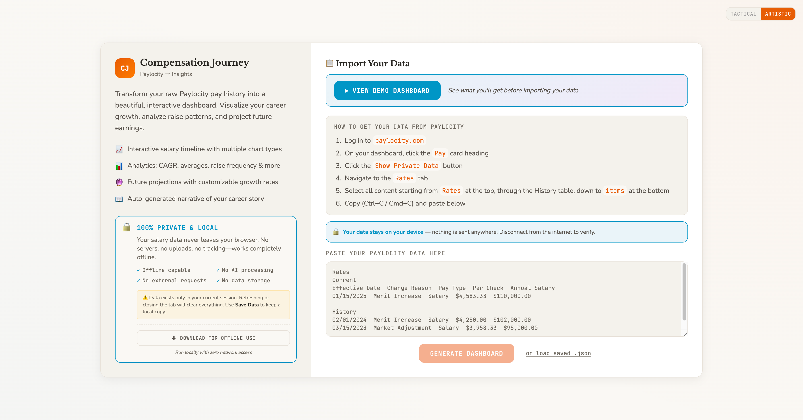
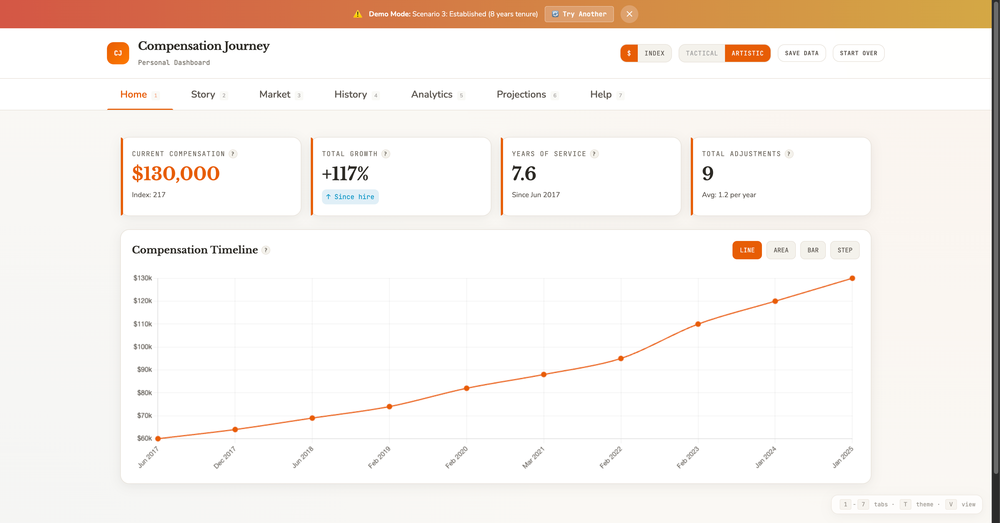

# Compensation Journey

Turn your Paylocity pay history into an actual useful dashboard with market benchmarks, inflation analysis, and insights you'd expect from any modern financial tool.

Paylocity gives you raw pay history tables. It doesn't show you CAGR, market comparisons, inflation-adjusted growth, or any of the metrics an employee would actually want to see. So here's a tool that does.

**[Live Demo](https://tejasgadhia.github.io/paylocity-compensation-journey/)**

## Screenshots

**Artistic Theme (Light Mode)**


*Splash screen with data import instructions*


*Dashboard with compensation timeline and key metrics*

**Tactical Theme (Dark Mode)**


*Same dashboard in tactical (dark) theme*


*Benchmark analysis against B2B SaaS industry standards*

## What This Does

Paste your Paylocity pay history, get seven tabs of analysis:
- **Home** - KPIs and main compensation timeline chart
- **Story** - Auto-generated narrative of your compensation journey
- **Market** - How you stack up against B2B SaaS benchmarks (CAGR, raise %, inflation-adjusted growth)
- **History** - Complete compensation records table
- **Analytics** - CAGR breakdowns, annual change rates, raise distribution
- **Projections** - Future salary calculator
- **Help** - Feature guide and keyboard shortcuts

Includes CPI data from Bureau of Labor Statistics for real purchasing power analysis. Two themes (Artistic and Tactical), privacy mode for screenshots, keyboard shortcuts, the works.

**Benchmark Transparency** (added in #147):
- All benchmarks sourced from Radford, Mercer, Levels.fyi, Glassdoor (2024 data)
- Geographic scope: **United States**, primarily tech hubs (SF Bay, NYC, Seattle, Austin, Boston)
- Industry focus: **B2B SaaS** (growth-stage companies, IC and mid-level roles)
- Full methodology and limitations disclosed in Market tab
- Last updated: **Q4 2024** (salary benchmarks), **Dec 2024** (CPI data)

Desktop-only. Mobile is intentionally blocked because responsive complexity isn't worth it for a financial dashboard.

## How to Use

1. **Open Paylocity** - Go to **My Information** → **Compensation**
2. **Access your pay history** - Click the **"Rates"** tab
3. **Enable private data** - Toggle **"Show Private Data"** (top right corner)
4. **Select all data** - Highlight from the "Rates" header row down to your last history entry
   - **Mac**: `Cmd + A` to select all
   - **Windows**: `Ctrl + A` to select all
5. **Copy the data** - `Cmd + C` (Mac) or `Ctrl + C` (Windows)
6. **Paste into this tool** - Return to Compensation Journey, paste into the text area, and click **"Generate Dashboard"**

That's it! Your data is processed entirely in your browser—nothing is uploaded anywhere.

**Pro tip:** Save your dashboard as JSON using the "Save Data" button. You can reload it anytime without re-pasting from Paylocity.

## Privacy

**Your data never leaves your device.** Period.

- 100% client-side processing (vanilla JavaScript)
- Zero server uploads or external requests
- No cookies, no storage, no tracking, no AI/ML APIs
- Works completely offline after the page loads
- Your salary data stays in your browser tab

Save as JSON to your computer if you want. Load it later. That's it.

### Don't Trust Me?

Fair. Here's how to verify this tool is truly private:

**Quick verification (2 minutes):**
1. Open the app in your browser
2. Press `F12` (or `Cmd+Option+I` on Mac) to open DevTools
3. Click the **Network** tab
4. Clear existing requests (trash icon)
5. Import your Paylocity data and interact with the dashboard
6. **Expected result**: Zero new network requests after initial page load

**Thorough verification (offline test):**
1. Click the **"Download this tool"** button on the splash screen (or right-click → Save Page As)
2. **Disconnect from the internet** (turn off Wi-Fi, unplug ethernet)
3. **Open the downloaded HTML file** in your browser
4. **Paste your Paylocity data** and generate your dashboard
5. **If it works offline, nothing was sent to a server**

**Audit the source code:**
- **View on GitHub**: [Source code](https://github.com/tejasgadhia/paylocity-compensation-journey) — all code is public and unminified
- **Search for network calls**: Run these commands (if cloned locally):
  ```bash
  grep -r "fetch(" .
  grep -r "XMLHttpRequest" .
  grep -r "navigator.sendBeacon" .
  ```
  **Expected result**: Zero matches in application code
- **Files to review**: `app.js`, `js/parser.js`, `js/charts.js`, `js/calculations.js`, `js/security.js`

**Read detailed verification guides:**
- **Privacy Audit Checklist**: [SECURITY.md Privacy Audit Checklist](SECURITY.md#privacy-audit-checklist) — Step-by-step verification instructions
- **Network Monitoring Guide**: [SECURITY.md Network Monitoring](SECURITY.md#network-monitoring-guide) — Real-time monitoring for paranoid users (DevTools, system-level, proxy methods)
- **Third-Party Audits**: [Audit Status](SECURITY.md#third-party-audit-status) — Current status and how to commission an independent audit

**Privacy promise**: Your salary data never touches a server. It processes in your browser tab and disappears when you close it (unless you explicitly save it).

## Security

This tool implements multiple security layers to protect against XSS and data injection attacks:

### Defense-in-Depth Approach

1. **Content Security Policy (CSP)**: Blocks inline scripts and external connections
2. **Input Validation**: Parser uses whitelist approach and range validation
3. **Output Escaping**: All user-controlled strings escaped before display
4. **Template Validation**: Type checking on all template interpolations

### XSS Protection

All user input (from Paylocity paste) goes through:
- **Parser validation** (`js/parser.js`): HTML tag stripping, whitelist-only reason strings
- **Range checks**: Salary values must be within realistic ranges ($1K-$10M annual)
- **Output escaping** (`escapeHTML()`): Applied before any `innerHTML` insertion

**Tested against**: Script injection, event handlers, JavaScript URLs, HTML entities

See [SECURITY.md](SECURITY.md) for complete security documentation, threat model, and verification steps.

## File Structure

```
compensation-journey/
├── index.html           # HTML + CSS (~4,300 lines)
├── app.js               # Main application logic (~1,950 lines)
├── js/
│   ├── charts.js        # Chart.js functions (~670 lines)
│   ├── calculations.js  # Financial calculation helpers (~320 lines)
│   ├── constants.js     # Named constants (~100 lines)
│   ├── parser.js        # Paylocity data parser (~300 lines)
│   └── security.js      # Template validation (~50 lines)
├── assets/
│   ├── js/              # Self-hosted Chart.js
│   └── fonts/           # Self-hosted JetBrains Mono, Space Grotesk
├── docs/
│   └── API.md           # Comprehensive API reference
├── screenshots/         # UI screenshots
├── tests/               # Playwright E2E + Vitest unit tests
├── README.md
├── CLAUDE.md            # Developer documentation
├── CHANGELOG.md         # Version history
├── LICENSE
└── .gitignore
```

## License

This project is licensed under the [O'Saasy License Agreement](https://osaasy.dev/).

**TL;DR**: You can use, modify, and distribute this project freely. You can self-host it for personal or commercial use. However, you cannot offer it as a competing hosted/managed SaaS product.

See [LICENSE](LICENSE) for full details.

---

**Disclaimer:** Benchmark data is approximate. This is for informational purposes, not financial advice. Your mileage may vary based on role, location, company stage, etc.
